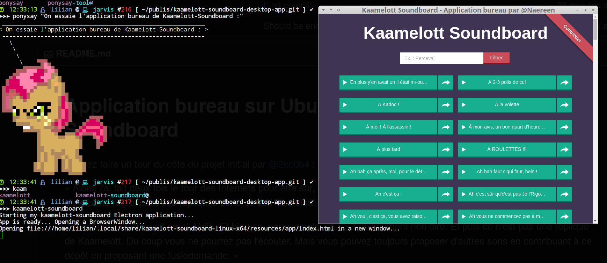
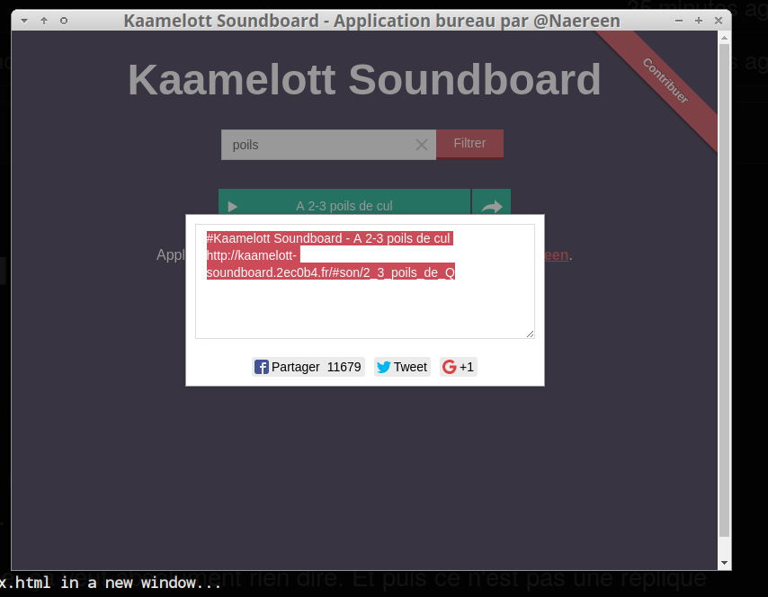
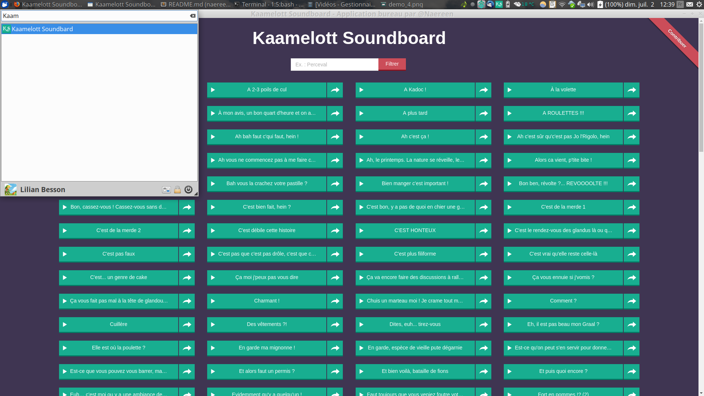
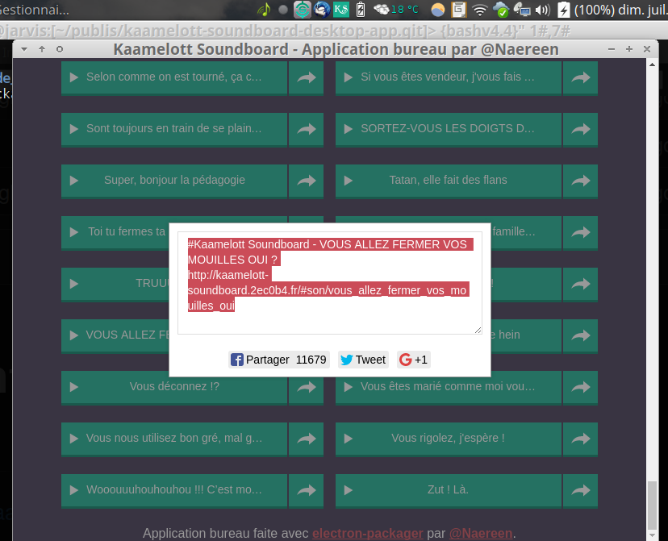
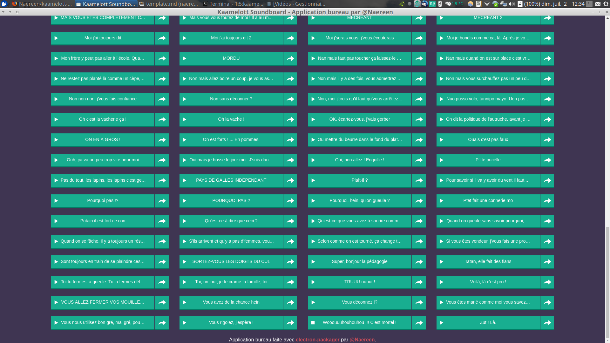

# Application bureau sur Ubuntu pour Kaamelott Soundboard
> Allez faire un tour du côté du projet initial par [@2ec0b4](https://github.com/2ec0b4/) : [kaamelott-soundboard](https://github.com/2ec0b4/kaamelott-soundboard/)

« Alors, j'ai fait deux fois le tour des Internets pour être sûr, eh ben croyez-moi, croyez-moi pas, je n'ai pas trouvé de plateforme regroupant des répliques sonores de Kaamelott. »

« _Lorem ipsum dolor sit amet._ Voilà. Et bien ça, par exemple, ça veut absolument rien dire. Et puis ce n'est pas une réplique de Kaamelott. Du coup vous ne pourrez pas l'écouter. Mais vous pouvez toujours proposer d'autres sons en contribuant à ce dépôt en proposant une fusiodemande. »

« Alors, c'est classe ou c'est pas classe ? Ou c'est classe ? »

> Citation de [@2ec0b4](https://github.com/2ec0b4/).

----

## Télécharger l'application bureau ?

1. [Ce gros fichier]() contient le dossier à installer, [l'icône](img/ks.jpg), le fichier [.desktop](Kaamelott-Soundboard.desktop) et le [`Makefile`](Makefile).
2. Téléchargez le, extrayez l'archive quelque part,
3. Allez dans le dossier correspondant, puis faites `make install_app`, `make test_app` et enfin `make register_app`.
4. Tester l'application en la cherchant dans le menu d'application de votre bureau. Et voilà.

## Construire l'application bureau

> Presque rien à faire, grâce au gentil fichier [`Makefile`](Makefile).

1. Vous aurez besoin de node et npm installés, puis installez `electron` et `electron-packager`. Si besoin, `sudo make install_node_npm` peut aider, mais là j'garantis rien.
2. Ensuite, suivez le `Makefile` et faites `make package` pour construire l'application bureau,
3. puis `make test` pour tester,
4. et si ça fonctionne, faites `make install_app`, puis `make test_app` et si ça marche, faites `sudo make register_app` pour l'ajouter à votre bureau,
5. et enfin si tout marche, nettoyer tout comme un grand avec `make clean_all`.
6. *« Merci, de rien, au revoir m'sieur dame... »*

## Démonstrations
Si vous vous êtes pas emmêlés les pinceaux comme des tanches pendant l'installation, vous devriez pouvoir faire comme moi :

### Lancement depuis un terminal

Normal.

### Partage des sons

Le lien utilisé pour le partage est celui [du site web](http://kaamelott-soundboard.2ec0b4.fr/), comme ça vos potes à Rome ou en Aquitaine peuvent écouter les mêmes sons que vous. « *Ça vous coupe le sifflet ça non ?* »

### Lancement via le menu d'application

Si le fichier [.desktop](Kaamelott-Soundboard.desktop) a été bien installé, l'application est disponible dans votre menu système.

### J'ai même mis un raccourcis dans ma barre d'application...

[*« Super, bonjour la pédagogie »*](http://kaamelott-soundboard.2ec0b4.fr/#son/bonjour_la_pedagogie)

### L'application peut être grande, ou petite, ou re-grande derrière !

### Bref, voilà.
> « [Putain il est fort ce con !](http://kaamelott-soundboard.2ec0b4.fr/#son/putain_il_est_fort_ce_con) » me souffle-t-on.

## Sur GNU/Linux seulement !!
- **Attention** : cette application n'a été testé que sur GNU/Linux (Ubuntu 17.04) mais ça devrait presque aussi bien marcher sur Mac OS X (changer les chemins et le nom de l'application), et probablement sur Windows.
- Mais ça ne m'intéresse pas. Essayez vous même !
- En plus, j'ai ni machine Windows, ni Mac, donc c'est un coup à passer pour des cons. Sans moi.

----

## Lancer le projet

Pour faire fonctionner le projet sur votre machine, vous devrez tout d'abord, depuis la racine, exécuter la commande `bower install` puis accéder au fichier `index.html` via le serveur Web de votre choix (Apache pour moi, quand je ne suis pas sioux et que je ne m'y prends pas comme un commanche).

## Contribuer

1. Scissionnez (cf. [Fork](http://bitoduc.fr/#F)) ce dépôt
2. Créez une nouvelle branche (`git checkout -b sons-qui-envoient-du-pate`)
3. Ajoutez vos sons (format _mp3_) dans le répertoire `sounds/` et référencez-les dans le fichier `sounds/sounds.json`
4. Idéalement, vous pouvez [utiliser Audacity pour uniformiser vos sons](https://github.com/2ec0b4/kaamelott-soundboard/blob/master/Audacity/README.md)
5. Enregistrez les modifications (`git commit -am "Mes sons qui envoient du paté"`)
6. Poussez vos modifications (`git push origin head`)
7. Créez une [fusiodemande](https://github.com/2ec0b4/kaamelott-soundboard/pulls)

## Liens

* Reddit : https://www.reddit.com/r/france/comments/5orvyf/kaamelott_soundboard_3/
* Application iOS : https://github.com/tnducrocq/kaamelott-sound-board-ios
* Application Android : https://play.google.com/store/apps/details?id=fr.androdev.kaamelottsounds

Merci, de rien, au revoir m'sieur dame... ([@2ec0b4](https://github.com/2ec0b4/kaamelott-soundboard/))

----

## Crédit et licence ?

> Crédit : [Antoine @2ec0b4](https://github.com/2ec0b4/kaamelott-soundboard/) pour l'application initiale.
> Idée initiale : [Naereen](https://github.com/Naereen), dans [cette discussion](https://github.com/2ec0b4/kaamelott-soundboard/issues/56), et voir notamment [cette réponse](https://github.com/2ec0b4/kaamelott-soundboard/issues/56#issuecomment-312480886).

> Licence : [Unlicense](http://unlicense.org). Parce que c'est pas trois gars en jupettes qui vont nous impressionner.
